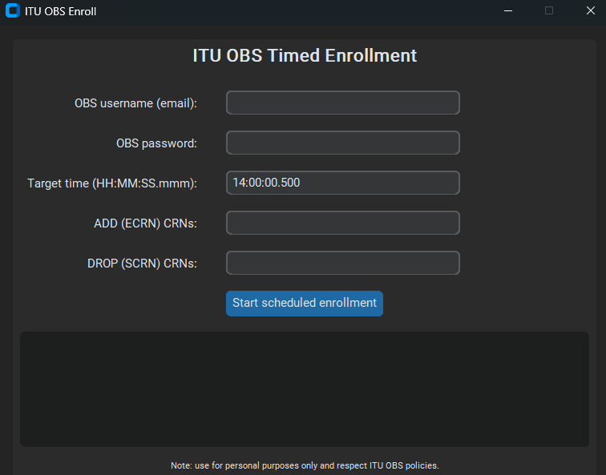

## ITU OBS Enrollment Helper

This repository contains a small Python script that helps automate course enrollment on
ITU OBS at an exact target time.



The tool:

- Logs into OBS using a Chromium browser controlled by Playwright.
- Retrieves a JWT bearer token via the official OBS endpoint.
- Sends a course enrollment request at a precise time.
- Can send additional requests in the same session if needed.

This project is intended for **personal use only**. Each user is responsible for complying
with the university's terms of use, rate limits, and academic integrity policies.

---

## Contents

- `itu_obs_enroll.py`: Main CLI script. Collects user input and sends enrollment requests.
- `itu_obs_enroll_gui.py`: Graphical user interface for configuring and starting a timed enrollment.
- `obs_login.py`: Helper module that logs into OBS with Playwright and fetches a JWT token.
- `requirements.txt`: Python dependencies.

---

## Installation

1. Make sure Python 3.10+ is installed.
2. Clone the repository:

```bash
git clone https://github.com/usarrahim/itu_obs_enroll.git
cd itu_obs_enroll
```

3. (Optional but recommended) Create and activate a virtual environment:

```bash
python -m venv .venv
.\.venv\Scripts\activate  # Windows
# veya
source .venv/bin/activate  # macOS / Linux
```

4. Install dependencies:

```bash
pip install -r requirements.txt
playwright install chromium
```

---

## Usage

Run the main CLI script:

```bash
python itu_obs_enroll.py
```

### Graphical user interface

To use the graphical UI instead of the terminal, run:

```bash
python itu_obs_enroll_gui.py
```

The window contains fields for:

- OBS username and password
- Target time
- ADD and DROP CRN lists

After the values are provided and the button is pressed, the application logs into OBS, waits
until the target time and sends a single enrollment request. Status, headers and body are shown
in the log area at the bottom of the window.

If you save a screenshot as `gui.png` in the project root, you can show it in this README:

```markdown

```

The script will ask for the following values in order:

1. **OBS username (email)**
2. **OBS password** (hidden input in the terminal)
3. **Target time** (for example `14:00:00.500`)
4. **ADD (ECRN) CRN list**  
   - Example: `12345, 23456, 34567`  
   - Leave empty to avoid adding any courses.
5. **DROP (SCRN) CRN list**  
   - Example: `11111, 22222`  
   - Leave empty to avoid dropping any courses.

Then:

- `obs_login.py` logs into OBS and calls `/ogrenci/auth/jwt` to obtain a JWT token.
- The script waits until the configured target time and sends a single enrollment request.
- After that, typing `"1"` and pressing Enter will send additional requests with the same session.

---

## Security Notes

- Do not hard-code your username or password in the source code. The script always reads
  credentials from the terminal at runtime.
- If you use an `.env` file locally, make sure it is ignored by git (the provided `.gitignore`
  already contains an `.env` entry) and never commit secrets.
- OBS endpoints and behavior may change over time. If login or token retrieval stops
  working, the logic in `obs_login.py` will need to be updated accordingly.

---

## Legal / Ethical Notice

- This project is not an official ITU product.
- You are fully responsible for how you use this script.
- Make sure you respect your university's automation rules, rate limits and all applicable
  terms of service and academic integrity policies.

